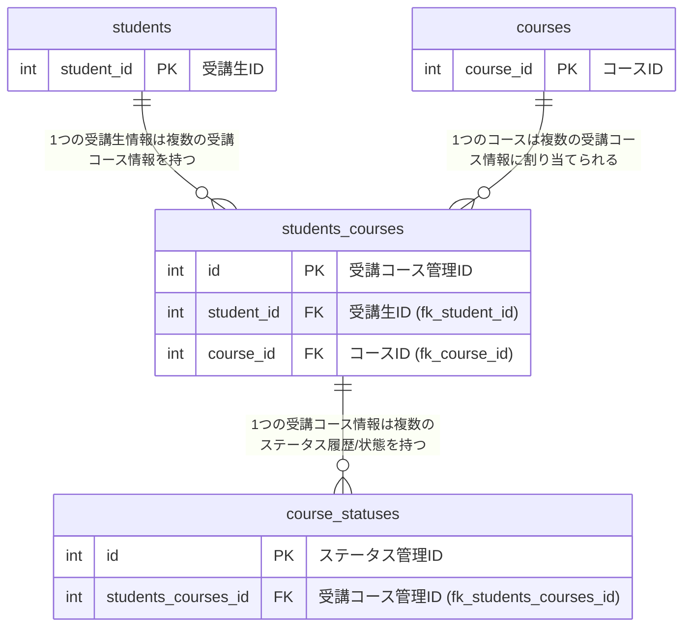
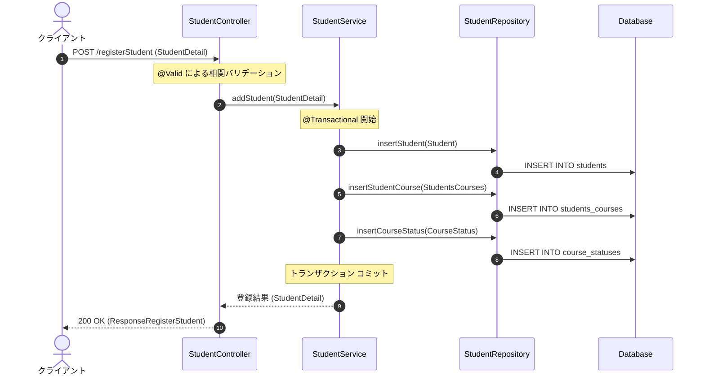

# Student Management System

受講生情報およびコース申し込み状況を管理・操作するための RESTful API Web アプリケーションです。

## 主な機能

* **受講生情報の検索・一覧取得**
* 受講生詳細情報の一覧取得（全件検索）
* 受講生IDを指定した単一検索
* 名前・フリガナ・年齢範囲・論理削除フラグ・コースIDによる複合条件絞り込み検索

* **受講生情報の登録・更新・論理削除**
* 新規受講生および関連コース情報の同時登録
* 受講生情報の更新
* 受講生ID指定による論理削除処理

* **コース情報およびステータスの管理**
* 全コース情報の一覧取得
* 受講状態ステータス定義（仮申込・本申込・受講中・修了）の一覧取得

* **入力チェック・例外ハンドリング**
* Jakarta Validation によるリクエストパラメータおよび DTO のバリデーション
* グループ化バリデーション（新規登録用 `RegisterGroup` / 更新用 `UpdateGroup`）の適用
* API 仕様可視化のための OpenAPI (Swagger UI) の導入

## 技術スタック & バージョン

* **Java**: 21
* **Framework**: Spring Boot 3.3.2
* **Build Tool**: Gradle (Dependency Management 1.1.6)
* **Database / ORM**: MySQL (`mysql-connector-j`) / MyBatis 3.0.3
* **Template Engine**: Thymeleaf
* **API Documentation**: OpenAPI 3 (`springdoc-openapi` 2.5.0)
* **Testing**: JUnit 5 (JUnit Platform) / Mockito / MyBatis Test 3.0.3 / Jakarta Validation / AssertJ / H2 Database 2.2.224
* **Utilities**: Lombok, Apache Commons Lang 3.14.0
* **Frontend**: HTML / CSS / JavaScript (Vanilla JS)

## ER図

## 代表的な処理フロー（データ登録のシーケンス図）
受講生登録（POST /registerStudent）処理を例にした、レイヤー間の具体的なコール順序とデータの流れです。

## セットアップ & 実行方法

### 動作要件

* **JDK**: Java 21 以上（`build.gradle` で Toolchain 設定済み）
* **Gradle**: 8.x 以上（リポジトリ内の Gradle Wrapper `./gradlew` を使用可能）
* **Database**: MySQL 8.0 以上（ローカルで実行する場合は指定のポート・DB接続情報が必要）

### 起動手順

1. **リポジトリのクローン**
`git clone https://github.com/keita-yamao/StudentManagement.git`
`cd StudentManagement`

2. **アプリケーションの起動**
`./gradlew bootRun`
3. **動作確認・API ドキュメント**
* アプリケーション: http://localhost:8080
* Swagger UI: http://localhost:8080/swagger-ui.html

## テスト & 品質保証

Web 階層、ビジネスロジック階層、データベース操作階層に加え、入力検証（バリデーション）の単体テストを網羅的に実施しています。

* **コントローラー層のテスト (`StudentControllerTest`)**
* `@WebMvcTest` および `MockMvc` による各 HTTP エンドポイントのレスポンスステータス・JSON 構造検証
* `Mockito` を活用したサービス層のモック化および呼び出し検証
* 検索パラメータ未指定時の境界値検証や例外ハンドリングの検証

* **サービス（ビジネスロジック）層のテスト (`StudentServiceTest`)**
* `@ExtendWith(MockitoExtension.class)` を使用した純粋な単体テストの実行
* リポジトリ（`StudentRepository`）およびコンバーター（`StudentConverter`）をモック化し、引数検証（`ArgumentCaptor`）や状態変更ロジックを検証

* **リポジトリ（DB操作）層のテスト (`StudentRepositoryTest`)**
* `@MybatisTest` とインメモリ DB（H2 Database）を組み合わせた MyBatis マッパーの動作検証
* CRUD 処理（全件・条件検索、登録、更新）の正確性テスト

* **入力チェック・バリデーションのテスト (`ValidationTest`)**
* **コントローラーのパラメータ検証**: URL パス変数やリクエストパラメータに対する `ConstraintViolationException` ハンドリングの検証
* **DTO グループ化バリデーション**: `Validator` を用いた DTO の単体テスト。新規登録（`RegisterGroup`）と更新（`UpdateGroup`）それぞれのコンテキストに応じた制約ルールの妥当性を検証

### テストの実行

`./gradlew test`
